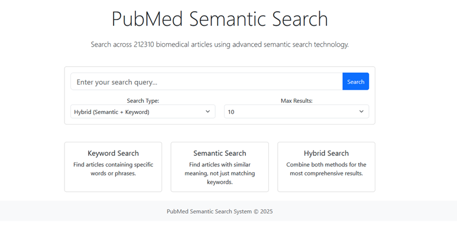
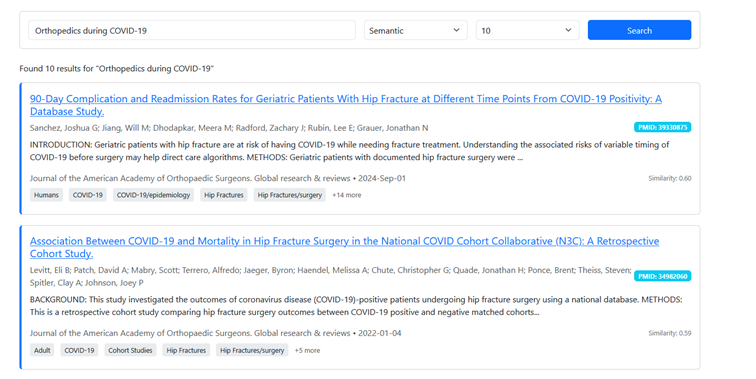
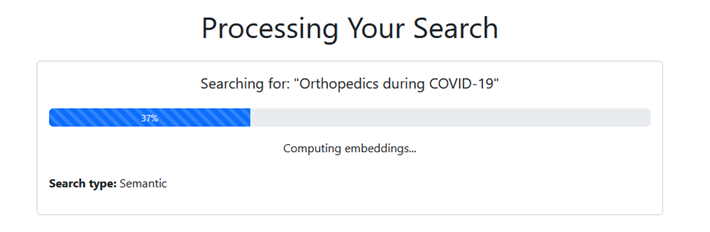

# PubMed Semantic Search

A visual exploration of a web application for enhanced biomedical literature search, combining semantic understanding with traditional keyword search.

## What is PubMed Semantic Search?

PubMed Semantic Search enhances the traditional PubMed experience by adding semantic search capabilities. This allows researchers and healthcare professionals to find relevant literature not just by exact keyword matches, but also by conceptual similarity.

## Visual Tour

### Home Page

  

The home page features a clean search interface with options to select search methodology and result count.

### Search Results

  

Results are presented with clear article information, including titles, authors, publication details, and MeSH terms. Each result card shows the relevance score based on the search method used.

### Article Detail View

The detailed article view provides the complete abstract, all authors, journal information, and MeSH terms, with a direct link to view the article on PubMed.

### Search Progress Indication

  

Real-time search progress indicators show the system working through the search process.

## Features Demonstrated

### Three Search Methods

- **Keyword Search**: Traditional search matching specific words or phrases
- **Semantic Search**: Using NLP to find conceptually similar articles
- **Hybrid Search**: Combining both approaches for comprehensive results

### User Experience

- Clean, responsive design that works on desktop and mobile devices
- Real-time search progress indicators
- Detailed article views
- MeSH term visualization
- Direct links to PubMed

## Behind the Scenes

The application leverages advanced natural language processing technology to understand the meaning behind biomedical text. Each article's content is encoded into high-dimensional vectors that capture semantic relationships between medical concepts.

When you search, your query is similarly encoded and compared with all article vectors to find the closest matches in this "meaning space" - even when different terminology is used.

## Project Status

This project is currently in development. Code will be made available at a later stage.

## Get In Touch

Interested in learning more or contributing to this project? Open up a issue in this repository
